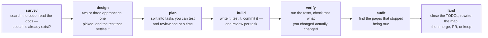
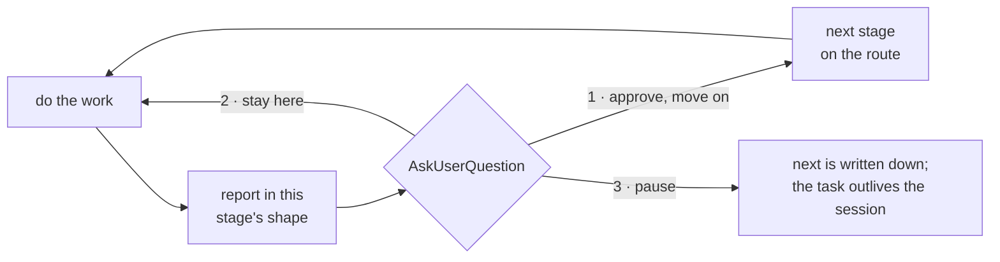

# FanKeel

A keel is the one structural member a hull cannot lose.

Long-running projects rot in ways that are invisible from inside any one session.
Components get rebuilt because nobody knew an equivalent existed. Design documents
pile up after the work they described has shipped. Conventions hold for a month
and then quietly stop. And two terminals open on the same repository will happily
edit the same file, because neither knows the other is there.

fankeel is a Claude Code plugin that carries a development discipline and states
it on every prompt — and again on every answer — rather than once at the top of a
session. It holds a task, moves
it along a route it picked through seven stages, keeps a capped note of what has
been tried, and shows which other live sessions are in the same files.

## Install

```
claude plugin marketplace add FanFantom9452/FanKeel
claude plugin install fankeel@fankeel
```

Restart Claude Code afterwards. Nothing else is installed: no dependencies, and
the tests run on `node --test`, which is built in.

Then, in any project:

```
/fankeel
```

It looks before it asks — what is under this directory, which of them is a
repository, which was touched today — and then asks at most two questions, with
the options already on screen: which project, skipped when there is only one, and
what the task is, guessed from the recent commits. It does not ask which files you
will touch. Those are recorded as the edits land, so there is no list to state and
none to get wrong. Answer, and the statusline badge lights up.

> The repository is `FanKeel` and everything you type is `fankeel`. Plugin and
> marketplace ids have to be kebab-case — Claude Code accepts anything else, and
> the Claude.ai marketplace sync does not — so the id, the command, the badge word
> and the `.fankeel/` directory are all lowercase. GitHub does not care which case
> the repository is written in.

It is also one of the plugins [claude-kit](https://github.com/FanFantom9452/claude-kit)
installs, if you would rather take a whole machine's worth in one command — and
that kit wires up TokenBar, which is what draws the badge.

## The pipeline

Seven stages, each named for what it produces rather than how it feels. What
each one actually has you do:



What each stage *produces* — the artifact it is graded on, which is a different
question — is the table in [docs/pipeline.md](docs/pipeline.md).

**A route is the stages one task actually needs, in order.** Not every task is
seven. A class picks one when the task starts, and every prompt from then on
carries it with your position bracketed — so a two-stage task is never reported
as permanently unfinished at 2 of 7:

```
spike          route: [survey] → build                                          (1 of 2)
bounded        route: survey → design → [build] → verify → land                 (3 of 5)
architectural  route: survey → design → plan → [build] → verify → audit → land  (4 of 7)
```

Assembling a route by hand is a decision made silently; a class is the same
decision made out loud, where somebody can disagree with it before four stages of
work hang off it. The ratchet runs one way — complexity found mid-task upgrades
the route, and nothing downgrades it.

Only the current stage's rules are sent, and they are sent again every turn — a
pointer is only as strong as the salience of what it points at, and what it points
at recedes by thousands of tokens a turn.

### Every stage ends at a gate



The gate is not conditional on there being something to decide. Finishing a stage
is the moment the next decision exists, and the answer being predictable is not
the same as it having been given. Picking option one *is* the approval, so its
description says what is being approved — after `design`, that is the approach
itself.

Each stage also ships the **shape of its report**, not only a description of one:

```
- path +12/-3 — what changed
- path (new) — what it is

deferred: <TODO.md line, or omit this line>
then AskUserQuestion
```

What happens *inside* a stage — its steps, the scripts it runs, and the two or
three places each one branches — is drawn stage by stage in
[docs/pipeline.md](docs/pipeline.md).

## Where to find things

| I want to know | Page |
|---|---|
| What `/fankeel` asks me, the seven stages, and how a route is chosen | [docs/pipeline.md](docs/pipeline.md) |
| What `.fankeel/map.md` holds, and why a page marked design-intent is not drift | [docs/pipeline.md](docs/pipeline.md) |
| What gets written to disk, what is committed, and what `notes` and `next` are for | [docs/registry.md](docs/registry.md) |
| What `[FANKEEL:CLASH]` means, and how to make a collision block rather than warn | [docs/collisions.md](docs/collisions.md) |
| What `docs.json` declares, and why an archive naming deleted code is not a bug | [docs/documents.md](docs/documents.md) |
| What a subagent is told when it starts, and what its return value costs | [docs/subagents.md](docs/subagents.md) |
| The badge word, and how to colour each stage | [docs/statusline.md](docs/statusline.md) |
| Which output style to use, and why a style rather than an injected ruleset | [docs/output-styles.md](docs/output-styles.md) |
| Why any of it was built this way | [docs/decisions/fankeel-shell.md](docs/decisions/fankeel-shell.md) |

The full index, question by question, is [docs/README.md](docs/README.md).

## Recommended with TokenBar

fankeel writes one word to `~/.claude/modes/<session_id>/fankeel`, and
[TokenBar](https://github.com/FanFantom9452/ClaudeCodeCLI-TokenBar) renders any
flag it finds there — so the two work together with no wiring on either side:

```
[FANKEEL:BUILD] | Opus 5 | my-project | main ↑2 +42/-7 ?1
ctx ███▊░░░░░░  38%    ·    5h ██████▌░░░  66%   ↻ 1h 46m    ·    7d █████▊░░░░  58%
```

The word is the stage, not an intensity — a statusline earns its space by showing
what changes. `clash` takes the slot when another live session is in your files,
because at that moment the collision matters more than the stage.

Give each stage its own colour by naming the words in your TokenBar config; it
matches an exact mode word before falling back to the four intensity tiers:

```powershell
# ~/.claude/tokenbar-config.ps1
$badgeColors.fankeel = @{ off = 240; lite = 62; full = 68; ultra = 81
                          survey = 60; design = 62; plan  = 65
                          build  = 68; verify = 75; audit = 78
                          land   = 81; clash  = 196 }
```

All seven stages, not six: a word the palette does not name falls back to the four
tiers above it, which are one neutral ramp — so a single missing stage reads as
the badge having stopped working rather than as a stage without a colour.

The `.sh` equivalent, and what each colour is doing, is in
[docs/statusline.md](docs/statusline.md).

## The two audits

| | |
|---|---|
| `node scripts/docs-check.js` | Every reference still resolves. A second to run, and the `land` rules call for it. |
| `/fankeel-audit` | The fortnightly sweep: which pages have stopped being true, and which two of them disagree. Runs both scanners, reads the shortlist they produce, then offers the cleanup. It does not need an active task, so it also works on a repository nobody is in the middle of. |

Neither one decides that two documents contradict each other, because nothing
mechanical can. What the sweep does is turn "read all forty documents looking for
disagreements" into "read these two — they both describe `lib/badge.js`, and one
has not been touched since before it changed".

## Uninstall

```
claude plugin uninstall fankeel@fankeel
claude plugin marketplace remove fankeel
```

`.fankeel/` is left in place — it is the project's, not the plugin's. Delete it by
hand if you want it gone. Stale `~/.claude/modes/<session_id>/fankeel` flags are
pruned after 30 days while the plugin is installed; after uninstalling, remove any
that remain.

## Development

```
npm test
claude plugin validate .
```

`lib/` is pure logic, tested directly. `hooks/` is where stdin, stdout and process
exit live, and all five hooks are tested as subprocesses with real payloads.

Every hook exits 0 on every path, including every error path. A `UserPromptSubmit`
hook that throws blocks the prompt it was called for and a `PreToolUse` hook that
throws blocks the edit, and a plugin that can wedge your terminal is worse than no
plugin. The other three are not load-bearing that way, but a stack trace in front of
the user in the middle of somebody else's turn is its own kind of broken.

`node scripts/todo-check.js` says whether [TODO.md](TODO.md) is still an index —
every link resolving, no entry carrying detail that belongs in the file it points
at. The `land` stage rules call for it, because a plan deleted at `land` is a link
that just died.
