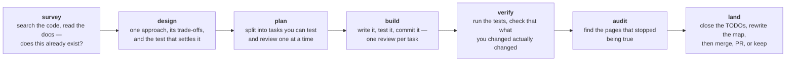
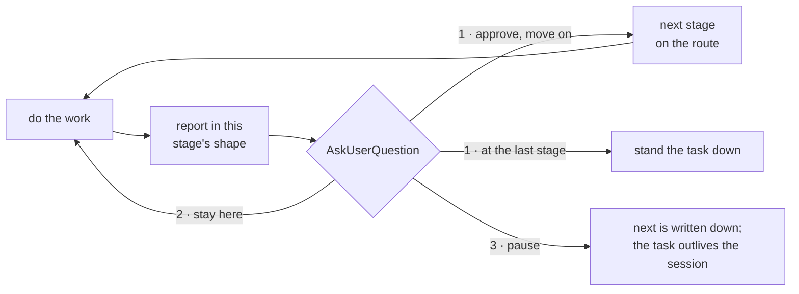

# FanKeel

A keel is the one structural member a hull cannot lose.

fankeel is a Claude Code plugin that carries a development discipline and states
it on every prompt — and again on every answer — rather than once at the top of a
session. It holds a task, moves it along a route it picked through seven stages,
keeps a capped note of what has been tried, and shows which other live sessions
are in the same files.

It exists because long-running projects rot in ways that are invisible from
inside any one session: components rebuilt because nobody knew an equivalent
existed, design documents piling up after the work they described has shipped,
conventions that hold for a month and then quietly stop, and two terminals
editing one file because neither knows the other is there.

## Install

```
claude plugin marketplace add FanFantom9452/FanKeel
claude plugin install fankeel@fankeel
```

Restart Claude Code afterwards. Nothing else is installed: no dependencies, and
the tests run on `node --test`, which is built in. Then, in any project:

```
/fankeel
```

It looks before it asks — what is under this directory, which of them is a
repository, which was touched today — and then asks at most two questions with
the options already on screen: which project, skipped when there is only one, and
what the task is, read from `TODO.md` where the root has one. It never asks which
files you will touch; those are recorded as the edits land.

> The repository is `FanKeel` and everything you type is `fankeel`. Plugin and
> marketplace ids have to be kebab-case — Claude Code accepts anything else, and
> the Claude.ai marketplace sync does not — so the id, the command, the badge
> word and the `.fankeel/` directory are all lowercase.

It is also one of the plugins [claude-kit](https://github.com/FanFantom9452/claude-kit)
installs, if you would rather take a whole machine's worth in one command — and
that kit wires up TokenBar, which is what draws the badge.

## Update

```
claude plugin marketplace update fankeel
claude plugin update fankeel@fankeel
```

Restart Claude Code afterwards, the same as installing. The marketplace line comes
first because `plugin update` compares against the listing already on disk — skip
it and there is nothing newer to find. Given no name, `marketplace update`
refreshes every marketplace at once. Re-running `claude plugin install` is not the
update path: the plugin is already installed, and what needs refreshing is the
marketplace listing behind it.

## Uninstall

```
claude plugin uninstall fankeel@fankeel
claude plugin marketplace remove fankeel
```

`.fankeel/` is left in place — it is the project's, not the plugin's. Delete it by
hand if you want it gone. Stale `~/.claude/modes/<session_id>/fankeel` flags are
pruned after 30 days while the plugin is installed; after uninstalling, remove any
that remain.

## The pipeline

Seven stages, each named for what it produces rather than how it feels:



**A route is the stages one task actually needs, in order.** Not every task is
seven. A class picks one when the task starts, and every prompt from then on
carries it with your position bracketed, so a two-stage task is never reported as
permanently unfinished at 2 of 7:

```
spike          route: [survey] → build                                          (1 of 2)
bounded        route: survey → design → [build] → verify → land                 (3 of 5)
architectural  route: survey → design → plan → [build] → verify → audit → land  (4 of 7)
```

Only the current stage's rules are sent, and they are sent again every turn — a
pointer is only as strong as the salience of what it points at. What each stage
produces, what happens inside one, and how a class picks a route are in
[docs/pipeline.md](docs/pipeline.md).

## Every stage ends at a gate



The gate is not conditional on there being something to decide: finishing a stage
is the moment the next decision exists, and the answer being predictable is not
the same as it having been given. Picking option one *is* the approval, so its
description says what is being approved — after `design`, that is the approach
itself. Each stage also ships the shape of its report, not only a description
of one — the shape `build` ships:

```
- path +12/-3 — what changed
- path (new) — what it is

done: <n> of <m> — ledger or file table
deferred: <heading> — <TODO.md line, or omit this line>
then AskUserQuestion
```

## The badge, and the station

fankeel writes one word to `~/.claude/modes/<session_id>/fankeel`, and
[TokenBar](https://github.com/FanFantom9452/ClaudeCodeCLI-TokenBar) renders any
flag it finds there — so the two work together with no wiring on either side:

```
[FANKEEL:BUILD] | Opus 5 | my-project | main ↑2 +42/-7 ?1
ctx ███▊░░░░░░  38%    ·    5h ██████▌░░░  66%   ↻ 1h 46m    ·    7d █████▊░░░░  58%
```

The word is the stage, not an intensity. `clash` takes the slot when another live
session is in your files, and `init` is the gap between `/fankeel` being submitted
and a task existing. The seven stage colours ship with TokenBar from v1.4.0 on;
the palette, both config formats and what each colour is doing are in
[docs/statusline.md](docs/statusline.md).

Every session this machine has run, live or abandoned or stood down, is one page:
the station — less any project whose profile sets `station.hide`, which appears
on no row, in no total and in no detail file. `node scripts/station.js --open` opens the newest, and `serve` in
place of that is the live form — [docs/station.md](docs/station.md).

## The three scanners

| | |
|---|---|
| `node scripts/docs-check.js` | Every reference still resolves. A second to run, and the `verify` and `audit` rules call for it. |
| `node scripts/residue.js` | What is in this tree that nobody decided about: untracked and unignored, a worktree whose branch is merged, an environment nothing can rebuild or run, the weight of what is ignored, directories holding no files. It never deletes. |
| `node scripts/docs-audit.js` | The fortnightly deep pass: which pages have stopped being true, and which two of them disagree. `/fankeel-audit` is the whole sweep — it runs all three, reads the shortlist they produce, then offers the cleanup. |

None of them decides that two documents contradict each other, because nothing
mechanical can. What the cap is, and why comparing two runs beats comparing two
headline counts, is in [docs/documents.md](docs/documents.md).

## Where to find things

| I want to know | Page |
|---|---|
| What `/fankeel` asks me, the seven stages, and how a route is chosen | [docs/pipeline.md](docs/pipeline.md) |
| What `.fankeel/map.md` holds, and why a page marked design-intent is not drift | [docs/pipeline.md](docs/pipeline.md) |
| What gets written to disk, what is committed, and what `notes` and `next` are for | [docs/registry.md](docs/registry.md) |
| What `[FANKEEL:CLASH]` means, and how to stop a collision raising a prompt | [docs/collisions.md](docs/collisions.md) |
| What `docs.json` declares, and why an archive naming deleted code is not a bug | [docs/documents.md](docs/documents.md) |
| What a subagent is told when it starts, and when `/fankeel-ask` is worth the money | [docs/subagents.md](docs/subagents.md) |
| The badge word, and how to colour each stage | [docs/statusline.md](docs/statusline.md) |
| Every session on this machine on one page, and how to put an abandoned one down | [docs/station.md](docs/station.md) |
| Why fankeel ships no output style, and where its voice lives instead | [docs/decisions/2026-09-13-no-output-styles.md](docs/decisions/2026-09-13-no-output-styles.md) |
| How the plugin is built and checked, and the four scripts that stop a claim drifting | [docs/development.md](docs/development.md) |
| How to run the behaviour eval, and what to do when `claude plugin eval` says early access | [docs/evals.md](docs/evals.md) |
| Why any of it was built this way | [docs/decisions/fankeel-shell.md](docs/decisions/fankeel-shell.md) |

The full index, question by question, is [docs/README.md](docs/README.md).

## What lives where

One row per directory, and, in the three that run, the files worth opening
first — not every file in them: `hooks/` is what Claude Code calls, `scripts/`
is what a person or a skill runs, and `lib/` is what both of them call.
`node scripts/layout.js` prints the half of this a listing can derive; the
right-hand column is the half it cannot.

```
fankeel/
├── .claude-plugin/    plugin.json — the skills, the five agents, every hook and its timeout — and marketplace.json
├── .fankeel/          this repository's own settings: docs.json files each page, profile.json answers gates, .gitignore
├── agents/            the five subagents the stages dispatch — reader, reviewer, verifier, judge, fixer — with their tools and model
├── assets/            the station page: index.html, station.css and station.js, copied beside every page a write produces
├── docs/              reference pages, with decisions/, plans/, reports/, judgements/ and archive/ each filed by what it records
├── evals/             behaviour eval cases, one directory each, graded by scripts/eval.js with claude -p
├── hooks/             every hook Claude Code runs; each reads stdin, exits 0 on every path and leaves the work to lib/
│   ├── inject.js      UserPromptSubmit: the block on every prompt, the init block on /fankeel, the badge
│   ├── resume.js      PostToolUse on AskUserQuestion: the stage's rules again once a gate is answered
│   ├── gate.js        PreToolUse on AskUserQuestion: stamps when a gate opened, so the wait can be timed
│   ├── guard.js       PreToolUse on writes and shells: the scope guard, and read-only agents kept read-only
│   ├── touch.js       PostToolUse on Edit, Write, NotebookEdit: the files this task touched
│   ├── brief.js       SubagentStart: what a subagent is told about the task it was sent from
│   ├── carry.js       SessionStart on clear or fork: offers the task a /clear left behind
│   └── leave.js       SessionEnd: how the session ended and what it spent, and the station rewritten
├── lib/               the logic, as functions tested directly; nothing here reaches into scripts/ or hooks/
│   ├── registry.js    one entry per session under .fankeel/sessions/, written by rename so no read is torn
│   ├── stages.js      the seven stages, the three classes and their routes, every stage's rules and output shape
│   ├── render.js      the injected blocks: every prompt, after a gate, on /fankeel, for a subagent, after /clear
│   ├── live.js        which sessions are running, read from Claude Code's own sessions/<pid>.json
│   ├── overlap.js     which live sessions have touched the same files
│   ├── guard.js       the scope guard's answer to an edit in another live session's files: nothing, ask or deny
│   ├── badge.js       the statusline word and lead line TokenBar draws
│   ├── map.js         .fankeel/map.md: the signpost, the filing, this tree, the planned and retired pages
│   ├── docs.js        docs.json: buckets, roles, and which pages may be out of date
│   ├── station.js     the station's model: finding every registry, the rows, the data and detail scripts
│   ├── detail.js      one session taken apart for the station, cached by its files' size and mtime
│   ├── usage.js       what a transcript spent: requests, models, agents and every dispatch
│   ├── replay.js      a session's events in time order, and one agent's own steps
│   ├── plantasks.js   a plan's tasks, and which of them may run at once
│   └── profile.js     the project and machine profile: the standing answers to a gate
├── scripts/           the command line, thin wrappers over lib/
│   ├── task.js        start a task, move its stage, note, pause, stand it down
│   ├── orient.js      what is under this directory, before /fankeel asks anything
│   ├── map.js         writes .fankeel/map.md
│   ├── layout.js      prints the half of this tree a listing can derive
│   ├── survey.js      what already exists here, for the survey stage
│   ├── ledger.js      the build ledger: init, complete, groups, lint, brief
│   ├── station.js     writes the station page, or serves it live
│   ├── docs-check.js  every reference in the documents still resolves
│   ├── docs-audit.js  which pages stopped being true, and which two disagree
│   ├── residue.js     what is in the tree that nobody decided about
│   ├── todo-check.js  whether TODO.md is still an index
│   ├── judge.js       files what a fankeel-judge answered, verbatim
│   └── version.js     the release number, in every place that carries it
├── skills/            one directory per skill — fankeel, one per stage, ask, explain, station — and registry.json
└── tests/             node --test, one file per module or behaviour; tmp.js is where every scratch directory comes from
```

## Development

```
npm test
claude plugin validate .
```

`lib/` is pure logic, tested directly; `hooks/` is where stdin, stdout and process
exit live, and every hook exits 0 on every path, because a hook that throws blocks
the thing it was called for and a plugin that can wedge your terminal is worse than
no plugin. `todo-check.js`, `version.js`, `skills-check.js` and
`stage-registry.js` each hold one written claim to the code it describes, and
[docs/development.md](docs/development.md) says what each of them checks. The
behaviour eval and its runner are in [docs/evals.md](docs/evals.md).
