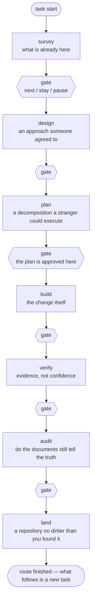
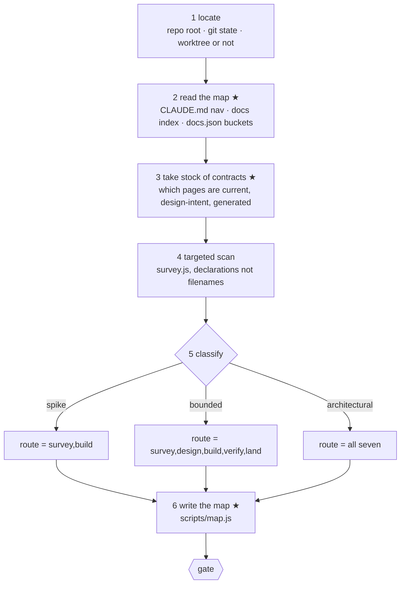
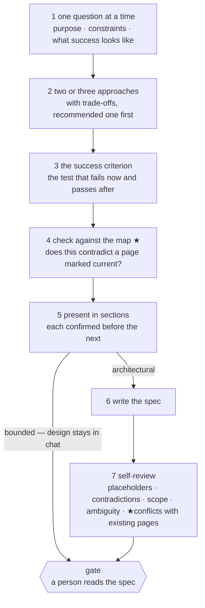
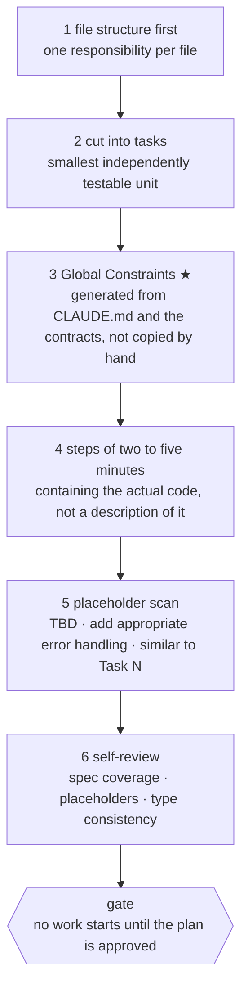
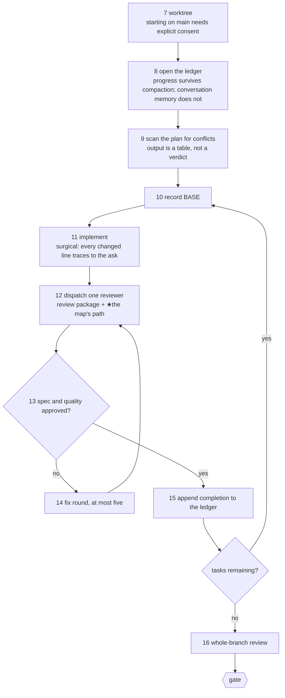
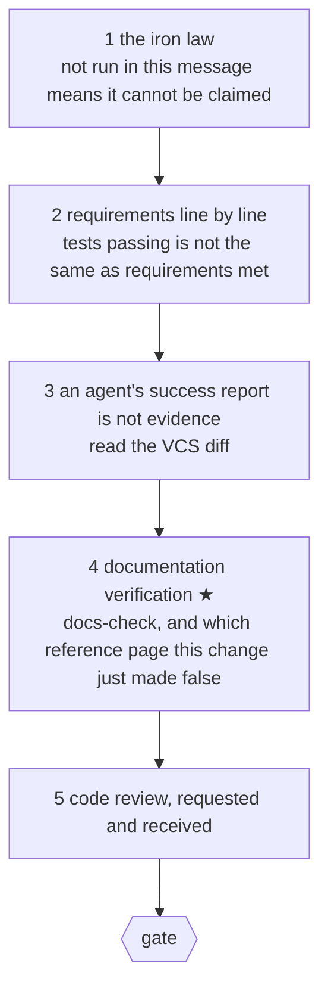
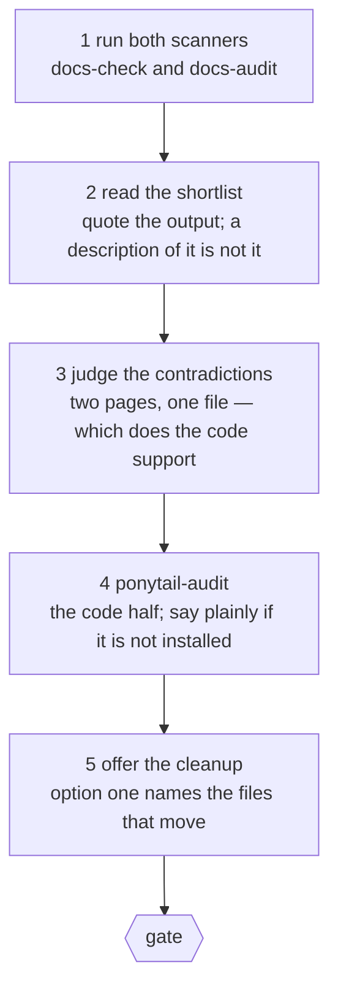
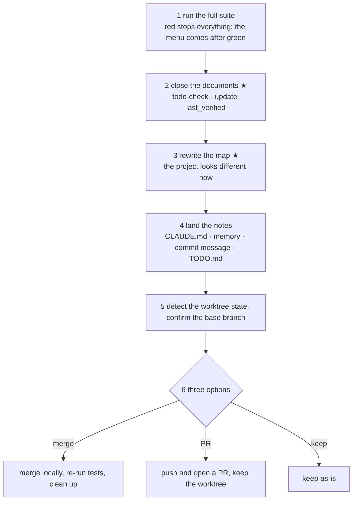

# Seven stages, and what happens inside each

The pipeline today is six stages with nothing inside them. A stage names what it
produces and injects its rules, and everything between "you are in `build`" and
"`build` is done" is improvised fresh each session.

This is the decomposition: a seventh stage, a named sequence of steps inside
every stage, and one artefact — a generated project map — that travels from the
first stage to the last so that no step has to rediscover what the project is.

Most of the step content is adapted from [superpowers][sp], read line by line
against what was already here. What was taken, what was changed, and what was
deliberately left is at the end.

[sp]: https://github.com/obra/superpowers

## What this fixes

A repository that has been running for a while accumulates documents describing
what it is *meant* to become alongside documents describing what it is. Nothing
in the pipeline reads either. Every stage starts from the files the task names
and infers the rest, which works on a project someone built last week and fails
on the one that has been stitched together from two systems.

superpowers has exactly one mechanism for this and it is worth naming precisely,
because the gap is in the mechanism rather than in the idea. `writing-plans`
mandates a **Global Constraints** block in every plan header:

> the spec's project-wide requirements — version floors, dependency limits,
> naming and copy rules, platform requirements — one line each, with exact
> values copied verbatim from the spec. Every task's requirements implicitly
> include this section.

So the global view is whatever a person remembered to copy out of the spec by
hand. Anything true of the project but absent from the spec never reaches the
work. That is the hole this closes.

## What was decided

| Decision | Choice | Why not the alternative |
|---|---|---|
| Relationship to superpowers | **adapt the text into this plugin** | Calling their skills keeps them updated but leaves their content unchangeable, and every change here is an addition to their content |
| Shape of the skill layer | **one skill per stage** | A single combined page gets read whole to reach one section; six separate names stay addressable |
| Where plan lives | **its own stage, seventh** | Plan approval is a human gate, and inside `build` it would contradict `build` running without stopping |
| How much of the subagent loop | **ledger and a reviewer per task** | The full implementer fleet needs a plan complete enough for a context-free agent; that is unproven here. Deferred, see `TODO.md` |
| Where the project map lives | **generated, not written** | Its content derives from `CLAUDE.md`, `docs.json` and the per-file contracts, and this plugin's own `build` rule says derivable content gets a generator |

## The route



Every arrow labelled *gate* is one `AskUserQuestion`. Nothing inside a stage is
one, which is what makes `build` able to run a task loop without stopping.

### Three preset routes

A route is already a first-class field — `task.js start --route`, and the
`●●●○○` on the statusline counts it. What is missing is the decision that picks
one, which is [superpowers' classification][sp] with the stations named:

| Class | Route | What it means |
|---|---|---|
| **spike** | `survey,build` | a feasibility question whose output is an answer. Anything built is labelled throwaway |
| **bounded** | `survey,design,build,verify,land` | a well-scoped change to a flow that already exists in this repository. Design happens in chat; no spec file, no plan file |
| **architectural** | all seven | a new subsystem, or a change to an interface others depend on |

Two rules carry over intact. **When in doubt take the heavier one**, and **the
ratchet is one-way** — hidden complexity found mid-task upgrades the route and
says so; nothing downgrades mid-task.

## The project map

```
node scripts/map.js   →   .fankeel/map.md
```

Generated, git-ignored, carrying `status: generated` so the documentation sweep
skips it. Regenerated at `survey` and again at `land`.

Three properties, each of which is a requirement rather than a nicety:

- **It is a file, so a subagent is handed a path.** superpowers learned this the
  expensive way: everything pasted into a dispatch prompt stays resident in the
  controller's context and is re-read every later turn — one observed dispatch
  reached 42k characters of which 99% was pasted history.
- **It is generated, so it cannot rot.** A hand-written map is the exact failure
  `/fankeel-audit` exists to catch.
- **It is per project, not per task.** Two sessions in one repository read the
  same map. This is what superpowers structurally cannot do: its global view
  lives in a plan file and dies with the plan.

What it holds: the `CLAUDE.md` navigation table, the documentation index, the
`docs.json` buckets, and — the part nothing else has — **every page's declared
status**, so that a document describing what the system is meant to become is
readable as intent rather than as a description that has drifted.

---

## survey

Produces a statement of what already exists, a classification, and the map.



**Step 3 is the one that was missing.** "Something was planned but never built"
had nowhere to be read from; now it is a status word on a page.

Step 5 announces its classification out loud so it can be overridden — a
classification made silently is one nobody can disagree with.

"Nothing matched" stays a finding: say which terms were tried, because the next
person needs to know a synonym was already ruled out.

## design

Produces an approach someone agreed to, and for `architectural`, a spec.



Step 4 is the addition. superpowers' spec self-review checks the spec against
itself; it never checks the spec against the project. A design that quietly
contradicts a page marked `current` is a contradiction that ships.

"Make it work" is not a criterion. Step 3 is what lets `build` run a loop
without asking — weak criteria are what turn an independent loop into constant
clarification.

## plan

Produces a decomposition someone with no context could execute.



**Step 3 is the whole reason this stage exists separately.** superpowers has the
right container and fills it by hand; filling it from the project is the change.

A task is the smallest unit that carries its own test cycle and is worth a fresh
reviewer's gate. Setup, configuration and documentation fold into the task whose
deliverable needs them; split only where a reviewer could reject one task while
approving its neighbour.

Step 5's list is not advisory. `TBD`, "add appropriate error handling", "write
tests for the above" without the test code, and "similar to Task N" without
repeating the code are **plan failures** — a plan is read by someone who may be
reading tasks out of order.

## build

Produces the change. **No gate inside this stage.**



Steps 7–9 are setup, 10–15 are the per-task loop, 16 closes it.

**The ledger is not optional bookkeeping.** superpowers names losing it as the
single most expensive failure they observed: controllers that lost their place
after compaction re-dispatched entire completed task sequences. The ledger's
first line names its plan file; a task with a `complete` line is done and is
never re-dispatched. After compaction, trust the ledger and `git log` over
recollection.

Step 9's output is **a table, not a verdict**: one row per pair of tasks sharing
a file or an interface, one row per task on whether its own text agrees with
itself. "The scan is clean" without those rows is not a scan that was run.

Step 11 is this session doing the work rather than a fleet of implementers —
that is the deferred half, and the reason is in `TODO.md`. What is kept from the
fleet version is the part that catches errors early: a fresh reviewer per task,
with a bounded fix loop, rather than one review of everything at the end.

**Rulings, not stalls.** Conflicts, ambiguities and plan defects get decided and
recorded in the ledger as `Ruling: <what> — <why> — <what it costs if wrong>`.
Four things stop the loop and only these: an irreversible operation, a
security-sensitive action, a side effect outside this workspace that norms say
you ask about first, and a plan so broken that every path forward is a guess.

## verify

Produces evidence.



The red flags are wording, not just conduct: "should", "probably", "seems to",
and any expression of satisfaction before the command has run.

Step 4 is the addition and it has no counterpart anywhere in superpowers. A
change that is correct and leaves three pages describing the old behaviour has
not been verified; it has been half verified.

## audit

Produces a shortlist a person can finish. Not on most routes — it is
documentation work, and whether it earns a place elsewhere is an open question
already in `TODO.md`.



Nothing mechanical decides that two documents contradict each other. The scanners
turn "read all forty documents looking for disagreements" into "these two both
describe `lib/badge.js`, and one has not been touched since before it changed".

## land

Produces a repository no dirtier than you found it.



Steps 2 and 3 are the additions. Step 4 already existed: a note that still
matters after the task lands was never a note.

Integration is the user's decision — present the menu and wait. Discarding work
is not on the menu; it happens only when asked for in so many words, and only
against the typed word `discard`. Worktree removal refused for uncommitted files
never gets `--force` on our own initiative.

---

## What was taken, changed, and left

| superpowers skill | Lands in | Changed how |
|---|---|---|
| `brainstorming` | survey 5, design 1–5 | classification maps onto a route; self-review gains the check against existing pages |
| `writing-plans` | plan 1–6 | Global Constraints generated rather than copied |
| `subagent-driven-development` | build 7–16 | implementer fleet deferred; reviewer per task and the ledger kept |
| `test-driven-development` | design 3, build 11 | compressed to the success criterion and the surgical rule; the full loop stays a reference |
| `verification-before-completion` | verify 1–3 | unchanged, plus documentation verification |
| `finishing-a-development-branch` | land 1, 5, 6 | unchanged, plus the documentation and map steps ahead of the menu |
| `using-git-worktrees` | build 7 | unchanged |
| `requesting-` / `receiving-code-review` | verify 5, build 12 | unchanged |
| `systematic-debugging` | — | left where it is; nothing here improves on it |
| `executing-plans` | — | superseded by build's loop |
| `dispatching-parallel-agents` | — | waits on the deferred implementer fleet |
| `writing-skills`, `using-superpowers` | — | meta |

## Two layers, and why

Stage rules are injected on **every** prompt and are capped at 1600 characters.
`subagent-driven-development` alone is 568 lines. So:

| | Carries | Cost |
|---|---|---|
| **injection** | the compressed law: the iron rule, the red-flag words, the surgical rule | re-sent every turn, survives compaction |
| **skill** | the full protocol: task structure, ledger format, review package, the menus | read once when the stage is entered |

Compression works where a rule is a principle. `verification-before-completion`
is 120 lines and three sentences carry it: *not run in this message means it
cannot be claimed*; *should, probably and Perfect! are red flags*; *an agent's
success report is not evidence — read the diff*. Ninety characters, affordable
every turn.

Compression fails where a rule is a format. The task template and the ledger's
first-line contract are literal text; abbreviating them produces something that
looks like the format and is not it. Those stay in the skill layer.

## What would prove this done

- `task.js start --class <c>` produces exactly the routes in the table above, and
  refuses one it does not know by listing the three with what each means.
  **Amended while building:** it does not *require* a class. Making it mandatory
  contradicts this document's own rule that `--class` and `--route` are
  alternatives, so the discipline of classifying out loud lives in the
  fankeel-survey skill rather than in the CLI.
- `scripts/map.js` run against `F:\ymlab\SBIR\ProjectWorkspace\Trovara` names its
  navigation table and reports which of its 121 documents are `design-intent` —
  a project whose documents are already in order is the one where a wrong map is
  easiest to spot.
- The same script against a project with no `CLAUDE.md` produces a map that says
  so rather than an empty one.
- A `build` stage resumed after compaction re-reads the ledger and re-dispatches
  nothing already marked complete.
- `verify` on a change that renames an exported function reports the reference
  page still naming the old one.
- Every stage's injected rules stay under the cap with the skill-layer pointer
  added.

## What is deliberately not being built

- **A global view assembled by reading everything.** The map is the project's own
  navigation, read; it is not a summary of the codebase.
- **A durable store beyond the four that exist.** `CLAUDE.md`, the memory
  directory, git history and `TODO.md` keep their jobs. Task memory stays capped.
- **A replacement for `systematic-debugging` or `ponytail`.** Over-engineering is
  ponytail's subject; the audit rules point at it rather than restating it.

[Back to the index](../README.md) · [Back to the front page](../../README.md)
