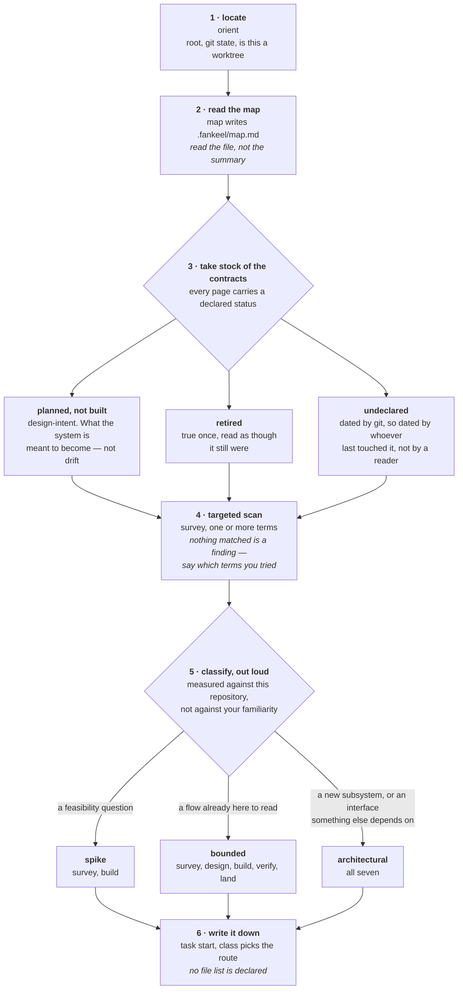
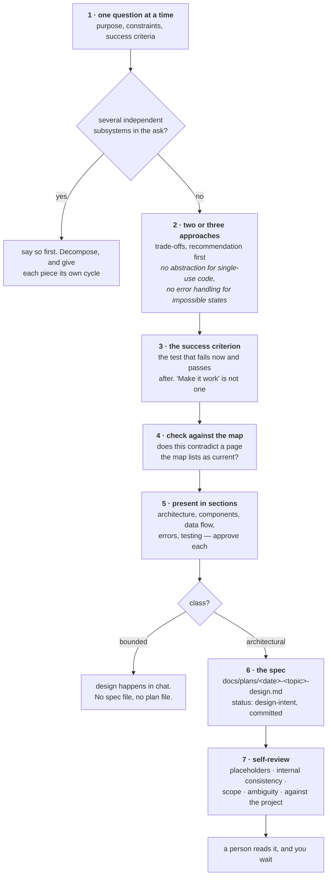
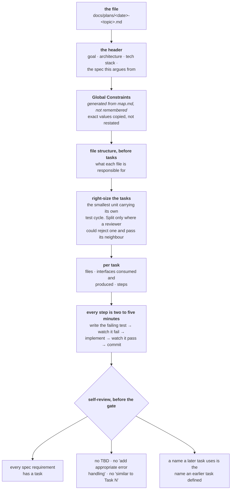
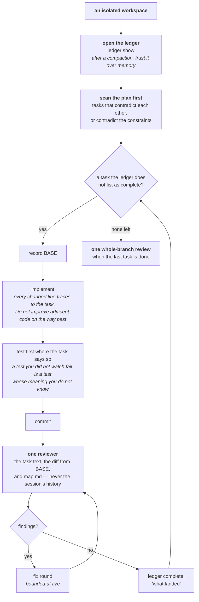
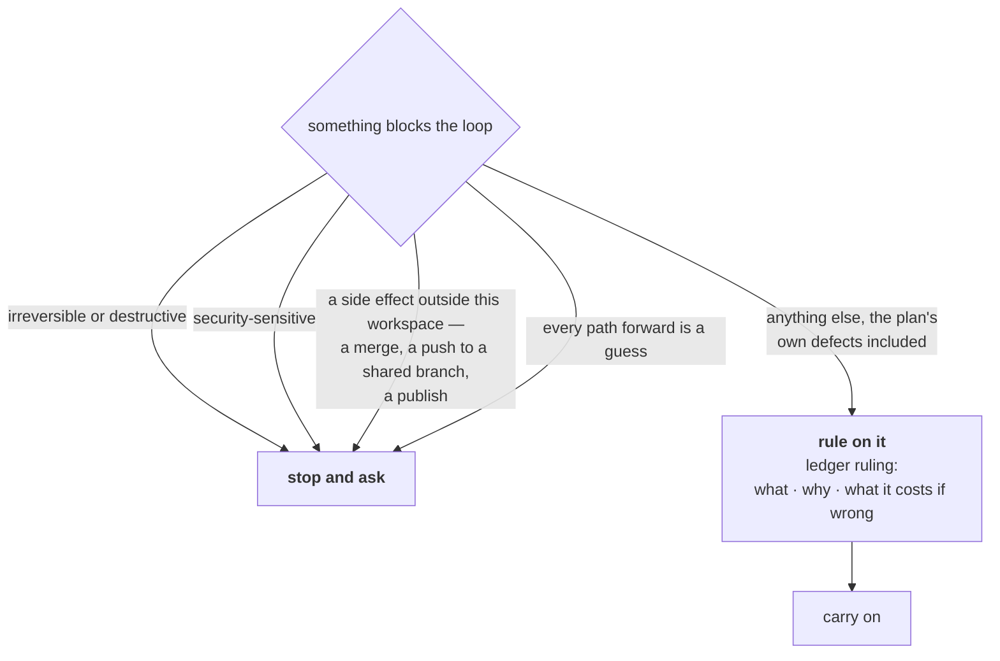
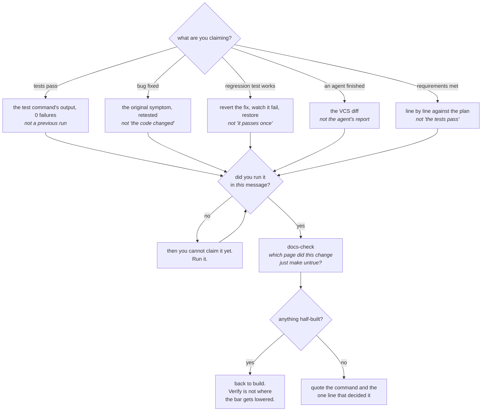
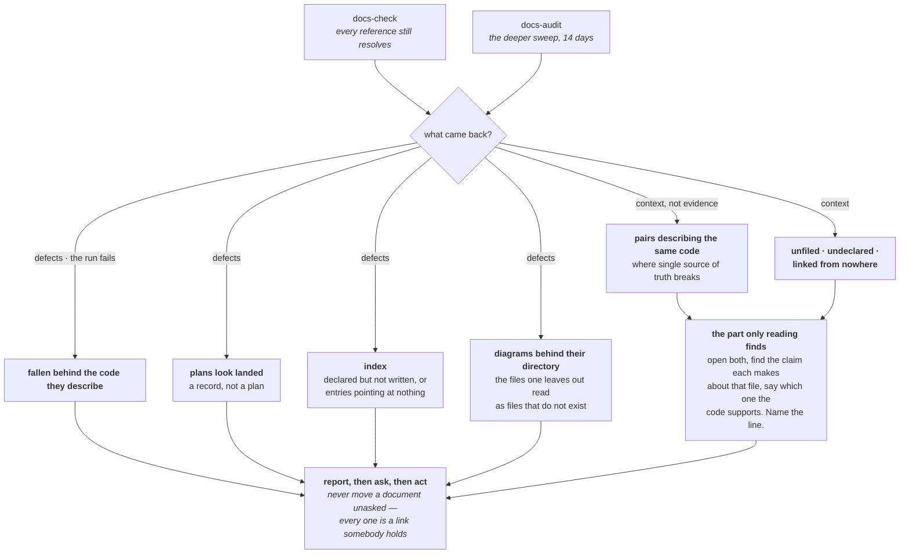
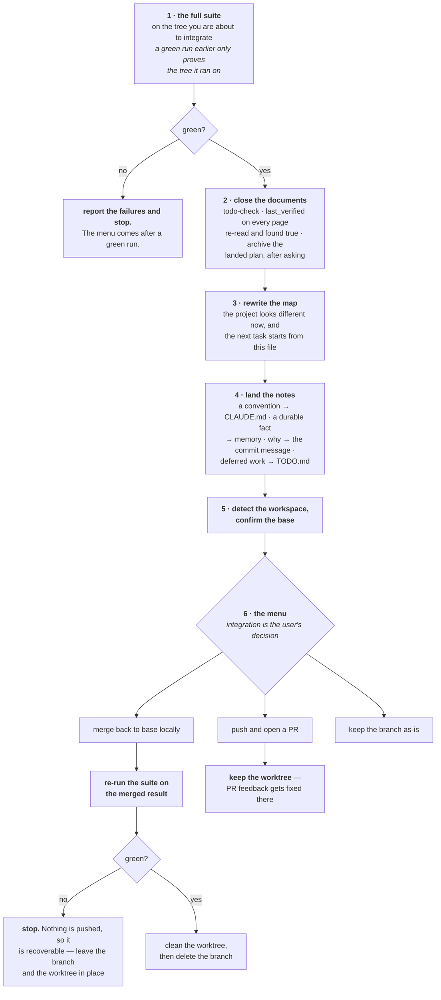

# The pipeline

What `/fankeel` does, the seven stages, how a route through them is chosen for
one task rather than picked from a menu, and the steps inside each stage.

# Use

```
/fankeel
```

It lists what every live session in this repository is working on and asks what
you want to do — carry on, start a task, adopt one, stand it down, or clear out
entries whose terminal is long gone.

Before it asks anything it looks. Opening with "give me a task" and nothing on
screen is answerable in a repository you just opened and useless in a directory
holding five projects, where the honest reply is another question and the
exchange costs two turns before any work starts. So `/fankeel` runs a scanner
first:

```
$ node <plugin>/scripts/orient.js

fankeel orient — F:\workspace

registry: none at or above here. Starting a task creates one at F:\workspace.

5 under it:
  Waypoint  git feat/task-board, 1 untracked  463 files  today
  KB        git main, 1 untracked             910 files  3d ago
  TypeDesk  git main, clean                   370 files  1mo ago
  notebin   git main, clean                    97 files  1mo ago
  Roster    no git                             77 files
```

Most recently committed first, with the age on every row so the order is
explicable rather than merely different. In a directory of five, the one touched
this morning is almost always the one being asked about.

The skill asks with `AskUserQuestion` rather than in prose — which project and
what the task is, in one call with the options already on screen.
Making someone retype a row of a listing they can see is the same waste as asking
with nothing on screen at all.

Name a place and it goes there instead, breaking that one down a level so what it
is made of is on screen too:

```
$ node <plugin>/scripts/orient.js Waypoint

named:
  Waypoint  git feat/task-board, 1 untracked  463 files

inside it:
  Waypoint/api/     134 files
  Waypoint/e2e/      93 files
  Waypoint/web/     199 files
  ...
  (and 12 files loose at the top)
```

For a single project it also says which of `CLAUDE.md`, `AGENTS.md`, `README.md`,
`TODO.md` and `CONTRIBUTING.md` are there — and says so plainly when none are —
and prints the last five commits, because what a project is in the middle of is
not visible in a listing of directories.

It writes nothing. Orientation that changes what it is describing is not
orientation.

Every change to a registry entry goes through one script rather than being
hand-written — `task.js start`, `task`, `stage`, `note`, `next`, `guard`, `down`,
`adopt`. It creates `.fankeel/.gitignore` with the directory, enforces the caps
and refuses rather than guessing. It was the last operation without a script, and
it failed the way unsupported steps fail — quietly, leaving no registry at all,
with the missing badge as the only symptom.

It also sets the badge itself on `start`, `task`, `stage`, `adopt` and `down`.
The hook runs *before* a prompt, so a badge left to it alone appears only when the
user types again — and for that whole gap, turning the mode on is indistinguishable
from failing to turn it on.

Starting a task does not then stop to ask whether to begin. The entry goes in at
`survey`, and taking stock is what `survey` is for, so it happens in the same
turn — otherwise the badge reads `▌FANKEEL SURVEY` at the exact moment nothing
has been surveyed.

Starting a task puts this session in fankeel mode. From then on every prompt
carries the task, what has been tried, the other live sessions, and the rules for
the stage you are in:

```
FANKEEL ACTIVE — rework the 7d deviation colour ramp @ build  (4 of 7)
route: survey → design → plan → [build] → verify → audit → land
project: Waypoint
touched: statusline.ps1, statusline.sh, preview.ps1
next: wire the badge word into TokenBar

so far:
  - ANSI 256 has no true mid green; 46 to 83 to 120 is the only clean run
  - decided 12h for stale, not 24h - survives a night, not a forgotten window

also in progress:
  - retune the 5h ramp @ design  (touched: statusline.ps1)  << overlaps: statusline.ps1
  - triage the colour issues @ survey  (touched: README.md)  (last seen 16d ago)

stage rules:
  - Never end a step silently or in prose. Ask with AskUserQuestion — next stage, stay, or pause, never dropping the pause. Option one is the approval: say what it approves.
  - The background goes inside the question call — in the option descriptions, beside the option each belongs to, never as a paragraph in the stem. The stem is one line. Recommended option first.
  - Say what you actually did. A step you skipped, a test that failed, a thing you could not check — say so plainly.
  - Write tool input in literal characters, never as \uXXXX escapes: escaped calls corrupt mid-word and fail to parse. Name a code concept in code — `overdue`, not a translation of it.
  - Finish what you start. Do not stop where the happy path works and the rest is "later".
  - From a plan (the fankeel-build skill has the loop): `node F:\ymlab\fankeel\scripts\ledger.js --plan <f> show` first and never redo a task it lists complete. One reviewer per task, then `complete <n> "<what landed>"`. After a compaction trust it over memory.
  - Decide rather than stall, recording `Ruling: what — why — costs if wrong`. Only four things stop the loop: irreversible, security-sensitive, a side effect outside this workspace, or every path forward a guess.
  - Every changed line traces to the ask. Follow the patterns already here; do not improve adjacent code, comments or formatting on the way past. Remove what your own change orphaned; dead code you did not create gets mentioned, not deleted.
  - Anything deferred goes in TODO.md as one line pointing at the detail — never as a comment nobody will find.
  - A new document is the last resort: put it in an existing page, or write a generator when the content is derivable from code. One that is written carries status, last_verified and source_of_truth — and a plan is not filed as reference.
  - Output: one line per file as `path +n/-m — what changed`, then the question. Under 80 words. The diff is the output; prose is for what it cannot show.

output shape:
  - path +12/-3 — what changed
  - path (new) — what it is

  deferred: <TODO.md line, or omit this line>
  then AskUserQuestion
```

The rules are restated in full every turn rather than pointed at. A pointer is
only as strong as the salience of what it points at, and what it points at recedes
by thousands of tokens a turn. Only the current stage's rules are sent, never all
seven stages', which is what keeps a per-turn restatement affordable — 2715
characters loaded as above, about 680 tokens.

It grows when growing it is worth something, because the two sides of that trade
are not priced the same. This block is read once a turn by the model and never by
the user; the answer it shapes is read by the user every time. The only limit
worth keeping is whether the block still gets read to the end — past that point a
preamble is skimmed, and skimmed rules are no rules.

Every stage's last rule is the shape of its output, and they are all the same
shape: what the stage produced, then the question. What differs is the form and
how much room it gets — 120 words for a survey, 200 for a design, 80 for a build,
one line per finding for an audit, one paragraph for a land. A number can be
missed; a direction cannot be, and *in the fewest words that let someone say yes
or no* let a design stage run to nine hundred.

Picking the first option *is* the approval, which is why the rule says the option
has to name what it approves. "Build it" is a stage; "build this approach —
due-rules.js first, then the four pages" is a decision someone can make. It
matters most after `design`, where the product is a proposal and the gate is the
only place it gets accepted.

The first rule names the tool, and that is the point of it. It used to say *end
every step by asking what comes next*, and a real design stage duly ended with
three numbered options in a paragraph — which is asking, and is also the failure:
the options were on screen and the reader still had to type one back. Naming
`AskUserQuestion` in the skill file was not enough, because a skill file is read
once at session start and this rides every prompt.

# The answer is not a prompt

That last claim had a hole in it, and a real session found it. *Every prompt*
means every prompt somebody types. An answer to an AskUserQuestion comes back as
a tool result, and `UserPromptSubmit` does not fire for a tool result — so a
session driven the way this pipeline asks to be driven is the one session where
the block never returns. One run spent 511 transcript entries and forty-four
minutes on a single injection.

The step that broke was the one where another skill's output contract — *End
with the only metric that matters: `net: -<N> lines possible.`* — was loaded
twelve entries before generation, competing with rules five hundred entries
behind it. It ended in prose with no question at all, and the user had to type
`CONTINUE` to get the pipeline moving again. The turn after that had the block
back, and gated properly. Eleven of the twelve steps in that session ended in an
AskUserQuestion; the twelfth is the one that had a competing contract nearer to
hand than its own rules.

So there is a second hook. `PostToolUse` matched to `AskUserQuestion` — and to
nothing else — sends a short form back the moment an answer lands:

```
FANKEEL ACTIVE — rework the 7d deviation colour ramp @ build  (4 of 7)
route: survey → design → plan → [build] → verify → audit → land

stage rules:
  - Never end a step silently or in prose. Ask with AskUserQuestion — next stage, stay, or pause, never dropping the pause. Option one is the approval: say what it approves.
  - The background goes inside the question call — in the option descriptions, beside the option each belongs to, never as a paragraph in the stem. The stem is one line. Recommended option first.
  - Say what you actually did. A step you skipped, a test that failed, a thing you could not check — say so plainly.
  - Write tool input in literal characters, never as \uXXXX escapes: escaped calls corrupt mid-word and fail to parse. Name a code concept in code — `overdue`, not a translation of it.
  - Finish what you start. Do not stop where the happy path works and the rest is "later".
  - From a plan (the fankeel-build skill has the loop): `node F:\ymlab\fankeel\scripts\ledger.js --plan <f> show` first and never redo a task it lists complete. One reviewer per task, then `complete <n> "<what landed>"`. After a compaction trust it over memory.
  - Decide rather than stall, recording `Ruling: what — why — costs if wrong`. Only four things stop the loop: irreversible, security-sensitive, a side effect outside this workspace, or every path forward a guess.
  - Every changed line traces to the ask. Follow the patterns already here; do not improve adjacent code, comments or formatting on the way past. Remove what your own change orphaned; dead code you did not create gets mentioned, not deleted.
  - Anything deferred goes in TODO.md as one line pointing at the detail — never as a comment nobody will find.
  - A new document is the last resort: put it in an existing page, or write a generator when the content is derivable from code. One that is written carries status, last_verified and source_of_truth — and a plan is not filed as reference.
  - Output: one line per file as `path +n/-m — what changed`, then the question. Under 80 words. The diff is the output; prose is for what it cannot show.

output shape:
  - path +12/-3 — what changed
  - path (new) — what it is

  deferred: <TODO.md line, or omit this line>
  then AskUserQuestion
```

Where the task is, the rules for the stage, the shape — 1336 to 1614 characters
depending on the stage, around 350 tokens. Deliberately not the full block: the
touched list, the notes and the other live sessions cannot have moved between a question
going out and its answer coming back, they are already in the context a few
thousand tokens up, and a stage runs through several questions. Repeating them
each time leaves a pile of copies disagreeing about which stage this is.

The cost is not what it looks like. The whole conversation is sent on every model
call whether or not anything is injected, and a prompt cache is a prefix — text
appended at the end never invalidates it. A real turn in that session billed
`cache_read 243,455` against `cache_creation 788`: the history at a tenth of the
price, and only the new tail written. Twelve answers at ~350 tokens is about
4,200 tokens of cache write across a whole session, which buys back the one
thing this plugin exists to hold.

The other way to close it was a `Stop` hook returning `decision: block` when a
turn ends without a question. That is a harder gate and it was not taken: it
costs a whole extra model turn every time it fires, which is output rather than
input and therefore the expensive half; it loops if the hook forgets to check
`stop_hook_active`; and it blocks the legitimate case where somebody asks a
plain question mid-task and gets a plain answer.

# Stages, and the route through them

| Stage | Produces |
|---|---|
| `survey` | a statement of what already exists |
| `design` | an approach someone agreed to |
| `plan` | a decomposition someone with no context could execute |
| `build` | the change itself |
| `verify` | evidence, not confidence |
| `audit` | a list of what is no longer true |
| `land` | a repository no dirtier than you found it |

### Three classes, three routes

Assembling a route by hand is a decision made silently. A class is the same
decision made out loud, which is what lets somebody disagree with it before four
stages of work hang off it.

| Class | Route | What it means |
|---|---|---|
| `spike` | `survey,build` | a feasibility question whose output is an answer. Anything built is labelled throwaway |
| `bounded` | `survey,design,build,verify,land` | a scoped change to a flow already in this repository. Design happens in chat: no spec file, no plan file |
| `architectural` | all seven | a new subsystem, or a change to an interface something else depends on |

```
node <plugin>/scripts/task.js start --session <id> --task "..." --class bounded
```

`--class` and `--route` together are refused rather than ranked: whichever one
lost would be a decision the user made and cannot see. Bounded measures the
repository rather than your familiarity with it — it means the flow being changed
is already here to read, so a new project is architectural however well you know
the kind of thing it is. When in doubt, take the heavier one.

## Inside each stage

The table above says what each stage produces. Below is how each one gets there:
the steps, the scripts, and the branch the stage actually has. They are not seven
copies of one shape — `build` is a loop, `verify` is a lookup from claim to
evidence, `land` is a sequence that stops dead on a red suite — and the shape is
most of what there is to know about a stage.

Every one of them ends at the same gate, so the gate is drawn once, on the
[front page](../README.md), and left off all seven here.

### survey

Six steps, and the first three read the project before the fourth searches it.
The order is the point: a scan run before the map is a scan whose results have
nothing to be read against.



Step 3 is the one with no counterpart in any other stage. A page marked
`design-intent` describes what the system is meant to become; treating it as a
description of the code is the specific failure survey exists to prevent, and it
is invisible unless somebody looked at the status line.

Step 5 is said out loud so it can be overridden. A classification made silently
is one nobody can disagree with — and the class is what four stages of work hang
off. The ratchet runs one way: hidden complexity found mid-task upgrades the
route, and nothing downgrades it.

### design

The gate never scales down. What scales is the artefact — a short design in chat
for a bounded change, a committed spec for an architectural one — and the two
paths diverge only at step 6.



Step 4 has no counterpart anywhere else either. A self-review checks a document
against itself; only this step checks it against the project. A design that
quietly contradicts a page marked current is a contradiction that ships.

### plan

The stage exists on its own for one reason, and it is the third box.



A constraint restated approximately is a constraint that will be violated
approximately. The version floors, the naming rules, the platform requirements —
those come out of the map at plan time, not out of what anybody remembers of the
spec.

### build

The only stage that loops, and the only one whose memory is a file rather than a
conversation.



A running plan does not wait on a person. What happens when something blocks it
is the other half of the stage:



A wrong ruling costs rework the user can see and undo. A session parked on a
question costs their whole day and buys nothing. A finding you overrule is a
ruling, not a silence.

### verify

Not a checklist — a lookup. Every claim has one thing that establishes it, and
the things that feel like they establish it do not.



"Should", "probably", "seems to", and any expression of satisfaction before the
command has run — "Great", "Perfect", "Done" — are the stage's red flags.
Rewording does not exempt anything: a phrasing that implies success without a run
is the same claim.

### audit

Two scanners, and then the part neither of them can do.



The context sections are the ones to act on first when they appear, because every
defect check above them gets sharper once they are gone. A page that declares
`status: design-intent` stops being reported as fallen behind; a pair where one
page names the other as its `source_of_truth` stops being a pair.

### land

A sequence with two places it stops, and a menu it is not allowed to answer.



Discarding the work is not on that menu. It happens when the user asks for it in
so many words, and then only against the typed word `discard`. A worktree whose
removal is refused for uncommitted files never gets `--force` on anyone's own
initiative — those files exist nowhere else.

## The project map

```
node <plugin>/scripts/map.js   —>   .fankeel/map.md
```

Written at `survey`, rewritten at `land`, read by everything in between.
Generated rather than maintained, git-ignored, and carrying `status: generated`
so the documentation sweep skips it.

It holds the signpost file's navigation table, the filing declared in
`docs.json`, and — the part nothing else reports — **every page's declared
status**. That last section is the one the rest was built for:

```
planned, not built — 2:
  docs/plans/2026-08-22-seven-stage-pipeline.md
  docs/roadmap.md
```

A page marked `status: design-intent` describes what the system is *meant* to
become. It is not drifting when the code does not match it; it is doing its job.
Without somewhere to read that, a roadmap gets written into an architecture page
and then read as a description of what exists — which is how a stage designs
against a system nobody has built yet.

Three properties, each a requirement rather than a nicety. It is a **file**, so a
subagent is handed a path instead of a paste — everything pasted into a dispatch
prompt stays resident and is re-read every later turn. It is **generated**, so it
cannot rot into the failure `/fankeel-audit` exists to catch. And it is **per
project rather than per task**, so two sessions in one repository read the same
map and it outlives the task that built it.

**A task's route is these stages in some order, chosen for that task.** A typo fix
is `build,verify`. A documentation sweep is `survey,audit,land`. A feature is all
six. The route is assembled at the start from what the task actually is, not
picked off a menu, and confirmed along with the task line:

```
$ node <plugin>/scripts/task.js start --session <id>       --task "fix the 7d ramp" --route "build,verify"

fankeel — started, at build   route: build → verify
```

Every step must be one of the stages above, no repeats, `land` last if it is
there at all. `stage` refuses a stage that is not on the route; `route` changes
the route when the task turns out to be a different shape than it looked.

A fixed five made the progress indicator lie in both directions — two-stage work
sat at 2 of 5 looking permanently unfinished, and longer work got no credit for
the stages it invented. The route is what `●●●○○` on the statusline counts.

## audit checks what stopped being true

Documents outlive the code they describe, and a document read as current when it
is not produces exactly the confident wrong answer this plugin exists to prevent.

```
$ node <plugin>/scripts/docs-check.js

fankeel docs-check — 17 markdown files, tree: flat
  1 decision, 2 plan, 14 reference

12 in no bucket — nobody has said how long these stay true:
  docs/00-overview.md
  ...

3 references that no longer resolve:
  gone: docs/02-database.md:556  names docs/a.md  [reference]
  orphan: docs/03-api.md:88  createSession() is not declared anywhere  [reference]
  into-archive: docs/01-architecture.md:14  points at retired docs/archive/2026-01-01-old.md  [reference]
```

Only what can be decided mechanically, and fast enough to sit in front of every
land. Whether two documents contradict each other is not mechanical, and a script
that guessed would produce findings nobody could act on.

**What gets checked depends on the document's role.** An archive naming deleted
code is an archive doing its job; a reference page doing the same is the bug. A
plan naming files that do not exist yet is a plan. Reporting the three alike is
how a checker ends up nine parts noise and read once.

## the sweep, roughly fortnightly

A page where every reference resolves can still describe a system that was
replaced last month, and finding those costs a reading session — so the deep pass
runs on the cadence `/ponytail-audit` runs on, and is the documentation half of
the same fortnight.

```
$ node <plugin>/scripts/docs-audit.js

fankeel docs-audit — 18 markdown files, tree: flat (implied by the directories, not declared), window: 14 days

3 reference documents have fallen behind the code they describe:
  docs/01-architecture.md  (last touched 23d ago; web/src/pages/editor-page.js changed 22d after it)
  CLAUDE.md  (last touched 22d ago; e2e/helpers.js changed 21d after it)
  ...

1 plan looks landed — everything named now exists:
  docs/plans/2026-07-27-waypoint-mvp.md  (25 files, untouched 23d)

2 documents are missing from docs/README.md:
  docs/plans/2026-08-21-due-rules-unify.md
  ...

12 pairs describe the same code — read these against each other, strongest first:
  docs/01-architecture.md  ×  docs/06-config.md  (shared/canvas_rules.py, web/src/lib/canvas-rules.js +2)
  ...
```

It narrows rather than judges. Nothing mechanical decides that two pages
disagree; this turns *read all forty documents looking for disagreements* into
*read these two*. Only the first three sections fail the run — pairs, orphans and
uncovered directories are true of almost every healthy repository, and a command
that always exits non-zero has an exit code that means nothing.

A file half the documentation mentions is common ground, not a subject:
`api/entrypoint.sh` named in five pages produced ten pairs on the first real run,
none worth reading, and they pushed the pair sharing four files off the list.

Dates come from the commit log in one `git log`, not one per file, and fall back
to mtime for a working tree with no history. Where no `docs.json` exists the tree
is inferred from the directories, so it is worth running on a project that never
opted in.

For the code half, `audit` uses what is installed — `/ponytail-audit` if ponytail
is there, a graph query if graphify or codegraph is — and says plainly when none
of them are rather than implying a check ran.

[Back to the index](README.md) · [Back to the front page](../README.md)
